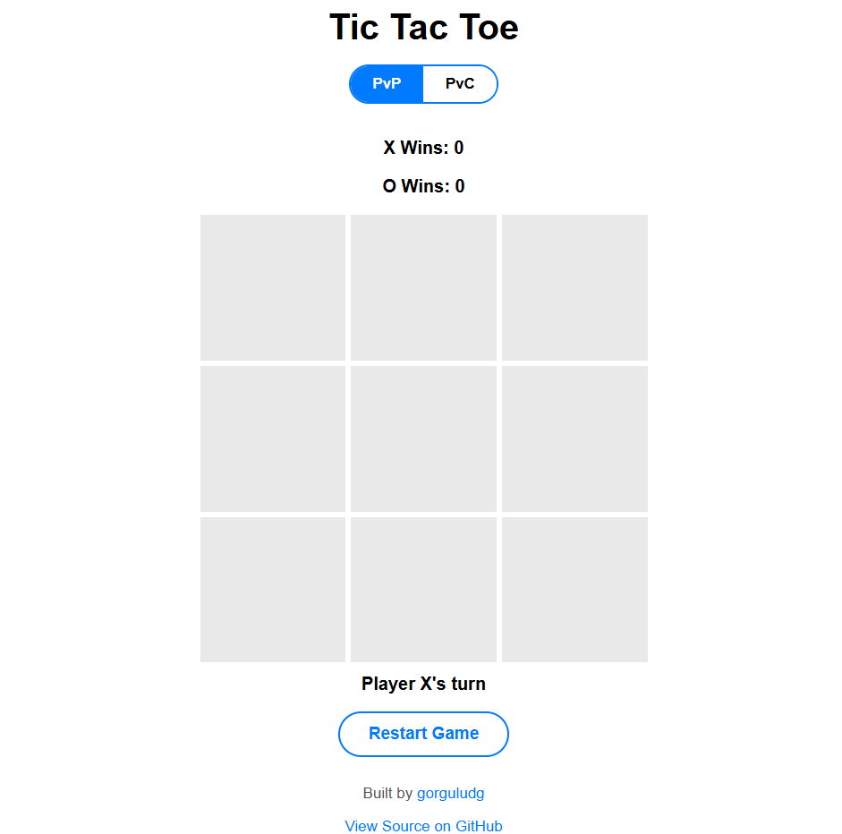

# 🎮 Tic Tac Toe - Web

A classic Tic Tac Toe game built with HTML, CSS, and JavaScript.

## 🕹️ Play Now

**[👉 Click Here to Play](https://gorguludg.github.io/tic-tac-toe/)**

## 📸 Screenshot

  

## ✨ Features

- 🎯 **Two Game Modes**
  - PvP - Player vs Player
  - PvC - Player vs Computer

- 🤖 **Smart AI Opponent**
  - Tries to win when possible
  - Blocks your winning moves
  - Strategic positioning

- 🎨 **Clean UI**
  - Modern design
  - Smooth animations
  - Responsive layout

- 📊 **Score Tracking**
  - X and O win counters
  - Persistent across rounds

- ✅ **Win Detection**
  - Green highlight on winning cells
  - Draw detection

## 🎮 How to Play

1. **Choose Mode**: Click "PvP" or "PvC"
2. **Choose Symbol** (PvC only): Click "X" or "O"
3. **Play**: Click empty cells to place your mark
4. **Win**: Get 3 in a row (horizontal, vertical, or diagonal)
5. **Restart**: Click "Restart Game" to play again

## 🛠️ Tech Stack

- **HTML5**
- **CSS3**
- **JavaScript (Vanilla)**

🤖 AI Strategy
The computer opponent uses this decision priority:

Win - Take winning move if available
Block - Block opponent's winning move
Random - Take any remaining cell

👨‍💻 Author
**gorguludg**
- GitHub: [@gorguludg](https://github.com/gorguludg)

GitHub: @gorguludg
- Android Version: [Tic Tac Toe Android](https://github.com/gorguludg/Tic-Tac-Toe-Android)